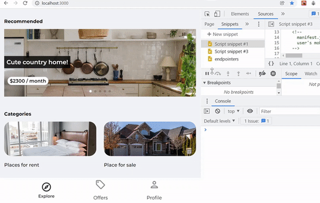
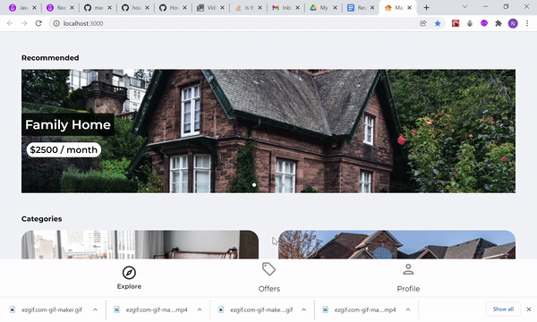
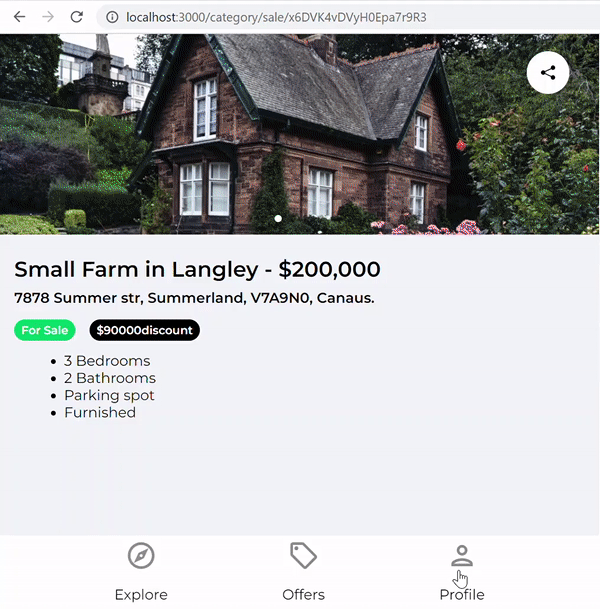
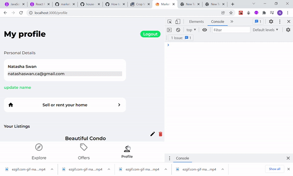
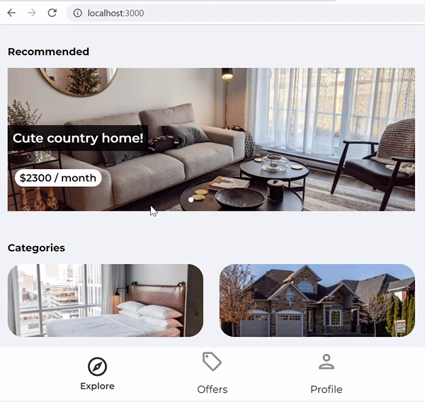

# Marketplace web app and React.js/Firebase v9/Firestore Application

> Individual Project for "React Front to Back 2022" course. 

### Status: complete, step-by-step tutorial version with minor changes.
___
## Table of Contents

  - [Description](#description)
  - [App structure with some screenshots](#app-structure-with-some-screenshots)
  - [Features](#features)
  - [Some tech specs](#some-tech-specs)
  - [Improvement Opportunities and known bugs](#improvement-opportunities-and-known-bugs)
  - [Technologies used:](#technologies-used)
    - [Dependencies:](#dependencies)
  - [Installation Requirements](#installation-requirements)
    - [Available Scripts](#available-scripts)
    - [`npm start`](#npm-start)
  - [Special Thanks](#special-thanks)

---
## Description 
This marketplace app allows users to browse property listings for rent and sale and contact the seller/landlord directly through the app. User can register with Google or on the website using a form and list a property for rent or sale. Registered users can add listings, edit and delete them.

## App structure with some screenshots
- **Homepage** with a navigation menu, carousel of newly added listings and two category links.
  

- **Category/rent(sale).** Listings of property for rent, three per page with a "load more" button at the end of the list. Clicking on a listing takes to the listing's page. 

- **Listing's page** with a carousel of property images and information about it. At the bottom of the page, there is a location map (map currently not active) and "contact seller/landlord" button, if the listing is not currently logged in user. The share button at the top right corner lets user copy the listing's link. 

- **Offers page** has listings that have discounted price set to true. Three listings per page with an ability to load more by clicking the "load more" button. 
- **Profile page** with personal details section that has registered user's email and name. User can update their name by clicking the "update name" button below the personal details section. The button activates the name field and lets user type in it. "Sell or Rent your home" button takes user on the create listing page. The listings section has all listings  posted by the logged in user. The delete button lets user delete the listing. The edit button takes user to the update listing page.

- **Create listing page** with toggle-buttons for choosing between sell/rent, parking spot?, furnished?, offer?; text fields for title, address and price, and images' section that lets user upload images. Pressing "Save Listing" saves the listing in the firestore database. Success/error msg notifies the user about success/error saving the listing. 

- **Edit listing page** opens a form that is pre-filled with existing property information except for the images. Images field is required. Currently there is no way to update images, but user can upload more. 

- **Contact seller** lets any user contact the seller/landlord by submitting a quick form in the app. 
- **Forgot password**. User gets a verification email with reset password instructoins if they are in the user's database. 
- **Sign-in/Sign-in with Google**. Registered users can sign in usng their email and password.

## Features

- Any user has access to/can:
  - add listings for rent/sale,
  - copy (share) the link to a listing,
  - see full info about a listing by clicking on a listing,
  - contact seller/landlord,
  - register with any email,
  - register with gmail.
  
- Registered users can:
  - create, update, delete listings,
  - update name in profile,
  - click the "forgot password" button for a verification email to be sent.

## Some tech specs
- Two databases in firestore: one for info about the users, another for the listings.
- Images are saved to firebase storage. Urls to images are stored in the listings' db.
- There is a limit of maximum 6 images per listing.   
- Progress when uploading images is shown in console.
- Error/success notifications.
  

## Improvement Opportunities and known bugs
1. Change the "create listing button" to a brighter color.
2. User cannot edit a listing without uploading a new image. 
3. Add an indication and perhaps a list of uploaded images on the edit lsting page.
4. Uploading two identical images are currently possible with the user not being able to see what they have already upload.
6. Contact seller/landlord form currently does not get submitted.
7. Cancel button can be added on the edit listing page.

## Technologies used:

### Dependencies:
- Front-end:
  - React
  - React-router-dom
  - Browser Router
  - Swiper React
  - React toastify
  - React icons
  - Swiper

- Back-end:
  - Firebase
  - Firestore
  - Firestore/storage
  - Firebase/auth

## Installation Requirements

This project was bootstrapped with [Create React App](https://github.com/facebook/create-react-app).

### Available Scripts

In the project directory, you can run:

### `npm start`

Runs the app in the development mode.\
Open [http://localhost:3000](http://localhost:3000) to view it in your browser.

The page will reload when you make changes.\
You may also see any lint errors in the console.

## Special Thanks
Boilerplate, Style and app architecture credits go to [@bradtraversy](https://github.com/bradtraversy). Another huge thank you for support goes to [@WillAdams](https://github.com/bushblade).

